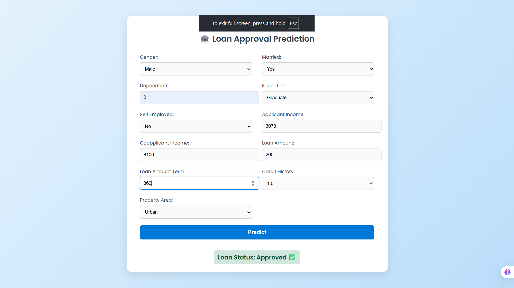
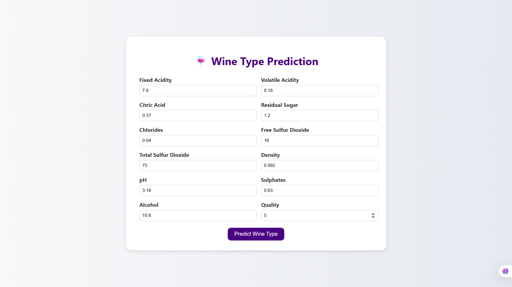
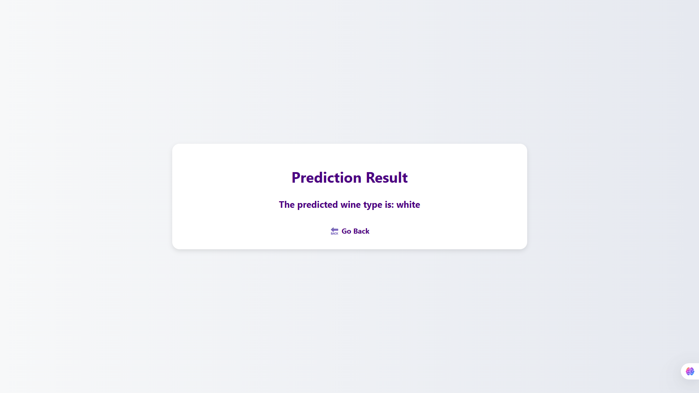

# 🧠 Machine Learning Classification Projects Repository

This repository contains two end-to-end Machine Learning projects:
1. 🏦 Loan Prediction using Machine Learning  
2. 🍷 Wine Type Classification using Machine Learning  

Each project includes data preprocessing, model training, SMOTE balancing, evaluation, and a Flask web application interface.

---

# 🏦 Loan Prediction using Machine Learning

## 📘 Overview
This project predicts whether a **loan application will be approved or not** using machine learning techniques.  
The dataset includes applicant demographic and financial details.  
To address class imbalance, **SMOTE (Synthetic Minority Oversampling Technique)** was applied to ensure balanced class distribution.

---

## 📊 Dataset
The dataset contains details of applicants and their loan application status.

| Column | Description |
|---------|--------------|
| Gender | Applicant's gender |
| Married | Marital status |
| Dependents | Number of dependents |
| Education | Education level |
| Self_Employed | Employment type |
| ApplicantIncome | Monthly income of applicant |
| CoapplicantIncome | Monthly income of co-applicant |
| LoanAmount | Loan amount requested |
| Loan_Amount_Term | Term of the loan (in months) |
| Credit_History | Credit history meets guidelines or not |
| Property_Area | Type of area (Urban/Semiurban/Rural) |
| Loan_Status | Target variable (Y = Approved, N = Not Approved) |

**Dataset used:** [loan.csv](loan_prediction/loan.csv)

---

## ⚙️ Technologies Used
- Python 🐍  
- Pandas, NumPy – Data processing  
- Matplotlib, Seaborn – Visualization  
- Scikit-Learn – Modeling & evaluation  
- Imbalanced-learn (SMOTE) – Data balancing  
- Flask – Web app deployment  

---

## 🧠 Model Building
The following classification models were trained and evaluated:

| Model | Purpose |
|--------|----------|
| Logistic Regression | ✅ Final selected model |
| Random Forest Classifier | Ensemble baseline |
| Support Vector Machine (SVM) | Margin-based classifier |
| Decision Tree Classifier | Interpretability check |
| K-Nearest Neighbors (KNN) | Distance-based classifier |
| Naive Bayes | Probabilistic model |
| Gradient Boosting | Boosted ensemble |
| AdaBoost | Adaptive boosting method |

**Data Preprocessing Steps**
1. Handled missing values  
2. Label-encoded categorical features  
3. Standardized numerical columns  
4. Applied **SMOTE** to balance classes  
5. Performed model training and comparison  

---

## 📈 Results
After evaluating all models, **Logistic Regression** was chosen as the final model due to its stable and interpretable performance post-SMOTE.

---

## 🖥️ User Interface Preview

---

# 🍷 Wine Type Classification using Machine Learning

## 📘 Overview
This project classifies **wine type (Red or White)** based on physicochemical properties such as acidity, pH, and alcohol content.  
Class imbalance was addressed using **SMOTE (Synthetic Minority Oversampling Technique)**.  
After testing multiple models, **Logistic Regression** was chosen as the final model based on **cross-validation performance**.

---

## 📊 Dataset
The dataset contains chemical characteristics of wine samples.

| Column | Description |
|---------|--------------|
| Fixed Acidity | Non-volatile acids in wine |
| Volatile Acidity | Acetic acid concentration |
| Citric Acid | Citric acid level |
| Residual Sugar | Sugar remaining after fermentation |
| Chlorides | Salt content |
| Free Sulfur Dioxide | SO₂ in free form |
| Total Sulfur Dioxide | Total SO₂ |
| Density | Density of wine |
| pH | Acidity level |
| Sulphates | Sulphate concentration |
| Alcohol | Alcohol content (%) |
| Type | Target variable (Red / White) |

**Dataset used:** [wine-quality-white-and-red.csv](wine_type/wine-quality-white-and-red.csv)

---

## ⚙️ Technologies Used
- Python 🐍  
- Pandas, NumPy – Data cleaning & preprocessing  
- Matplotlib, Seaborn – Visualization  
- Scikit-Learn – Model building & evaluation  
- Imbalanced-learn (SMOTE) – Data balancing  
- Flask – Deployment  

---

## 🧩 Model Building
Models trained and compared:
| Model | Description |
|--------|--------------|
| Logistic Regression | ✅ Final model after cross-validation |
| Random Forest Classifier | Ensemble learner |
| Support Vector Machine (SVM) | Margin-based classifier |

**Pipeline Steps**
1. Data normalization  
2. Label encoding for categorical variables  
3. Applied **SMOTE** for class balancing  
4. Trained multiple models  
5. Evaluated using **k-fold cross-validation**  

---

## 📈 Results
After evaluating all models, **Logistic Regression** provided the best accuracy and generalization after cross-validation.

---

## 🖥️ User Interface Preview

---

